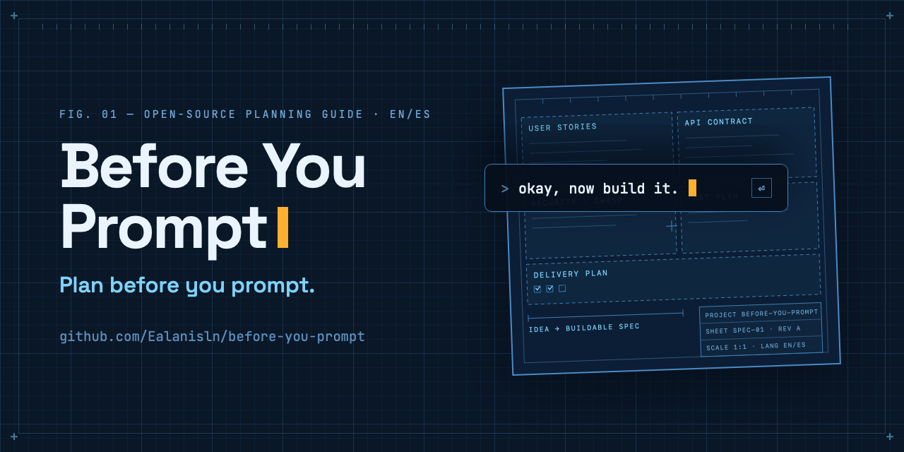

# Before You Prompt



> A modern planning guide for people who want to build a web project with AI —
> and have no idea where to start.

AI can write your code, but it can't decide what you're building. That part is
yours. **Before You Prompt** is a bilingual (English/Spanish) suite of planning
documents that walks you from "I have an idea" to a complete, buildable spec,
plus a [Claude Code](https://claude.com/claude-code) skill that generates and
fills it for you.

Reverse-engineered from a real-world requirements handoff that worked well, then
extended with the pieces most planning docs are missing: API contracts,
non-functional requirements, an OWASP-mapped security doc, a test plan, a
delivery plan, and a traceability matrix. Fill these documents first, hand them
to your AI (or your team), and every prompt you write afterwards gets sharper.

## What's inside

```
planning-template/
├── es/   13 documents in Spanish   (start at _GUIA.md)
└── en/   13 documents in English   (start at _GUIDE.md)
skill/planning-suite/               Claude Code skill (SKILL.md + assets)
integrations/                       Codex CLI, Gemini CLI, AGENTS.md, universal prompt
assets/social/                      Social/share images (OG card, banner, story)
INSTALL.md                          Installation guide (ES/EN)
install.sh                          One-step installer (macOS/Linux)
```

Each language tree contains:

| Doc | Purpose |
|-----|---------|
| `README.md` | Hub: objective, scope, actors, glossary, doc index, sign-off |
| `01` User stories | Fixed story template with MoSCoW priority and Given/When/Then criteria |
| `02` Technical specification | Field validation, data model, state flow, migrations |
| `03` API contracts | Auth, error envelope, per-endpoint schemas with worked example |
| `04` Non-functional requirements | Performance, SLA, device matrix, accessibility, observability |
| `05` Security | Per-area controls, accepted-risk register, **OWASP Top 10 (2021) mapping** |
| `06` Integration deep-dives | As-is/to-be diff, error catalogs, retry/idempotency policy |
| `07` Test plan | Test cases linked to stories, negative cases mandatory |
| `08` Delivery plan | Phases/MVP cut, environments, go-live, rollback |
| `09` Traceability matrix | Story → endpoint → table → screen → test case |
| `10` Open items | Numbered decision register, resolved in place with dates |
| Design prompt | Executable prompt to generate the UI prototype and design handoff |

## Design principles

- **WHAT → HOW → RISK → DEEP-DIVES → QUALITY → DELIVERY → UNKNOWNS** ordering.
- Stable ID spaces (`US-01`/`HU-01`, `OI-01`/`P-01`, `TC-01`/`CP-01`) so every
  document can cross-reference every other.
- Decisions are resolved **in place with a date**, never deleted; the open-items
  register doubles as a decision log.
- Deep-dives only for genuinely hard integrations; a minimal cut
  (README + 01 + 02 + 10) for small projects.
- Security is a first-class document with an explicit accepted-risk section.

## Install

```bash
./install.sh
```

Or manually: see [INSTALL.md](INSTALL.md). The templates are plain Markdown and
work without Claude Code; the skill adds `/planning-suite`, which interviews you
briefly and generates a filled suite in `<project>/docs/planning/`. The installer
also offers optional Codex CLI and Gemini CLI installs when it detects them.

## Usage

Run `/planning-suite` inside Claude Code in any project. It:

1. **Interviews you briefly**: objective, actors, scope, hard integrations,
   phases, one question at a time.
2. **Decides language and cut**: Spanish (`es/`) or English (`en/`) by project
   language, and minimal cut (README + 01 + 02 + 10) vs full suite by project
   size. It asks when unclear.
3. **Generates `docs/planning/`**: fills every placeholder from your answers,
   registers every unknown as an open item (`P-xx`/`OI-xx`), and builds the
   README index and traceability matrix last.

A typical session:

```
> /planning-suite
● What is the project's objective, in one or two sentences?
> An appointment-booking web app for a dental clinic, patients book online.
● Who are the actors? (e.g. patient, receptionist, admin)
> Patients and one receptionist who confirms appointments.
● Any hard external integrations (payments, legacy systems, SOAP...)?
> No, just email notifications.
● Phases? Or is this a single delivery?
> Single delivery, small project.
● Generating minimal cut (EN): README + 01-user-stories + 02-technical-
  specification + 10-open-items in docs/planning/ ... done.
  Registered OI-01 (email provider undecided). Review 10-open-items.md first.
```

**Manual mode**, no AI required: copy `planning-template/es/` or
`planning-template/en/` into your project, fill the `{{...}}` placeholders
following the `<!-- instruction -->` comments, and delete those comments. Start
with `_GUIA.md` / `_GUIDE.md`.

## Works with any AI tool

The templates are plain Markdown, so **any** tool works; native integrations just
add convenience. See [`integrations/`](integrations/README.md):

| Tool | Mechanism | Install |
|---|---|---|
| **Claude Code** | Skill → `/planning-suite` | `./install.sh` or `cp -R skill/planning-suite ~/.claude/skills/` |
| **OpenAI Codex CLI** | Skill or custom prompt → `/prompts:planning-suite` | [`integrations/codex/`](integrations/codex/README.md) |
| **Gemini CLI** | Custom command → `/planning-suite` | [`integrations/gemini/`](integrations/gemini/README.md) |
| **Cursor / Zed / Copilot** | `AGENTS.md` open standard | Paste [`integrations/AGENTS-snippet.md`](integrations/AGENTS-snippet.md) into your `AGENTS.md` |
| **Anything else** | Paste one prompt | [`integrations/universal-prompt.md`](integrations/universal-prompt.md) |
| **No AI at all** | Plain Markdown | Copy `planning-template/`, fill placeholders by hand |

## License

[Apache-2.0](LICENSE) — © Emmanuel Alanis.

---

## Español

> Una guía moderna de planeación para quien quiere construir un proyecto web con
> IA y no tiene idea de por dónde empezar.

La IA puede escribir tu código, pero no puede decidir qué estás construyendo.
Esa parte es tuya. Esta suite bilingüe de documentos de planeación te lleva de
"tengo una idea" a una especificación completa y construible, más un skill de
Claude Code que la genera por ti. Nació de la ingeniería inversa de un handoff
de requerimientos real que funcionó bien, extendido con lo que suele faltar:
contratos de API, requisitos no funcionales, seguridad con mapeo OWASP Top 10,
plan de pruebas, plan de entrega y matriz de trazabilidad. Llena estos
documentos primero, entrégaselos a tu IA (o a tu equipo), y cada prompt que
escribas después sale más afilado.

### Qué incluye

```
planning-template/
├── es/   13 documentos en español   (empieza en _GUIA.md)
└── en/   13 documentos en inglés    (empieza en _GUIDE.md)
skill/planning-suite/               Skill de Claude Code (SKILL.md + assets)
integrations/                       Codex CLI, Gemini CLI, AGENTS.md, prompt universal
assets/social/                      Imágenes para compartir (OG card, banner, story)
INSTALL.md                          Guía de instalación (ES/EN)
install.sh                          Instalador de un paso (macOS/Linux)
```

Cada árbol de idioma contiene:

| Doc | Propósito |
|-----|-----------|
| `README.md` | Hub: objetivo, alcance, actores, glosario, índice, aprobaciones |
| `01` Historias de usuario | Plantilla fija con prioridad MoSCoW y criterios Dado/Cuando/Entonces |
| `02` Especificación técnica | Validación de campos, modelo de datos, flujo de estados, migraciones |
| `03` Contratos de API | Auth, formato de errores, schemas por endpoint con ejemplo resuelto |
| `04` Requisitos no funcionales | Performance, SLA, matriz de dispositivos, accesibilidad, observabilidad |
| `05` Seguridad | Controles por área, registro de riesgo asumido, **mapeo OWASP Top 10 (2021)** |
| `06` Deep-dives de integraciones | Diff as-is/to-be, catálogo de errores, política de reintentos/idempotencia |
| `07` Plan de pruebas | Casos ligados a historias, casos negativos obligatorios |
| `08` Plan de entrega | Fases/corte MVP, ambientes, go-live, rollback |
| `09` Matriz de trazabilidad | Historia → endpoint → tabla → pantalla → caso de prueba |
| `10` Pendientes | Registro numerado de decisiones, resueltas en el lugar y con fecha |
| Prompt de diseño | Prompt ejecutable para generar el prototipo de UI y su handoff |

### Principios de diseño

- Orden **QUÉ → CÓMO → RIESGO → PROFUNDIZACIÓN → CALIDAD → ENTREGA → INCÓGNITAS**.
- Espacios de IDs estables (`HU-01`/`US-01`, `P-01`/`OI-01`, `CP-01`/`TC-01`) para
  que cada documento pueda referenciar a los demás.
- Las decisiones se resuelven **en el lugar y con fecha**, nunca se borran; el
  registro de pendientes funciona también como bitácora de decisiones.
- Deep-dives solo para integraciones genuinamente difíciles; corte mínimo
  (README + 01 + 02 + 10) para proyectos chicos.
- La seguridad es un documento de primera clase con sección explícita de riesgo
  asumido.

### Instalación

```bash
./install.sh
```

O manual: ver [INSTALL.md](INSTALL.md). Las plantillas son Markdown puro y
funcionan sin Claude Code; el skill agrega `/planning-suite`, que te entrevista
brevemente y genera la suite llena en `<proyecto>/docs/planning/`. El instalador
también ofrece instalar para Codex CLI y Gemini CLI cuando los detecta. Empieza
por `planning-template/es/_GUIA.md`.

### Uso

Ejecuta `/planning-suite` dentro de Claude Code en cualquier proyecto. El skill:

1. **Te entrevista brevemente** (objetivo, actores, alcance, integraciones
   difíciles, fases), una pregunta a la vez.
2. **Decide idioma y corte**: español (`es/`) o inglés (`en/`) según el proyecto,
   y corte mínimo (README + 01 + 02 + 10) o suite completa según el tamaño.
   Pregunta cuando no está claro.
3. **Genera `docs/planning/`**: llena los marcadores con tus respuestas, registra
   cada incógnita como pendiente (`P-xx`) y construye el índice del README y la
   matriz de trazabilidad al final.

Una sesión típica:

```
> /planning-suite
● ¿Cuál es el objetivo del proyecto, en una o dos frases?
> Una webapp de citas para una clínica dental, los pacientes agendan en línea.
● ¿Quiénes son los actores? (p. ej. paciente, recepcionista, admin)
> Pacientes y una recepcionista que confirma las citas.
● ¿Integraciones externas difíciles (pagos, sistemas legados, SOAP...)?
> No, solo notificaciones por correo.
● ¿Fases, o es una sola entrega?
> Una sola entrega, proyecto chico.
● Generando corte mínimo (ES): README + 01-historias-de-usuario +
  02-especificacion-tecnica + 10-pendientes en docs/planning/ ... listo.
  Registré P-01 (proveedor de correo sin decidir). Revisa 10-pendientes primero.
```

**Modo manual** (sin IA): copia `planning-template/es/` a tu proyecto, llena los
marcadores `{{...}}` siguiendo los comentarios `<!-- instrucción -->` y elimina
esos comentarios. Empieza por `_GUIA.md`.

### Funciona con cualquier herramienta de IA

Las plantillas son Markdown puro: **cualquier** herramienta sirve; las
integraciones nativas solo agregan comodidad. Ver [`integrations/`](integrations/README.md):

| Herramienta | Mecanismo | Instalación |
|---|---|---|
| **Claude Code** | Skill → `/planning-suite` | `./install.sh` |
| **OpenAI Codex CLI** | Skill o prompt → `/prompts:planning-suite` | [`integrations/codex/`](integrations/codex/README.md) |
| **Gemini CLI** | Comando → `/planning-suite` | [`integrations/gemini/`](integrations/gemini/README.md) |
| **Cursor / Zed / Copilot** | Estándar `AGENTS.md` | Pega [`integrations/AGENTS-snippet.md`](integrations/AGENTS-snippet.md) en tu `AGENTS.md` |
| **Cualquier otra** | Un prompt | [`integrations/universal-prompt.md`](integrations/universal-prompt.md) |
| **Sin IA** | Markdown puro | Copia `planning-template/` y llena a mano |
